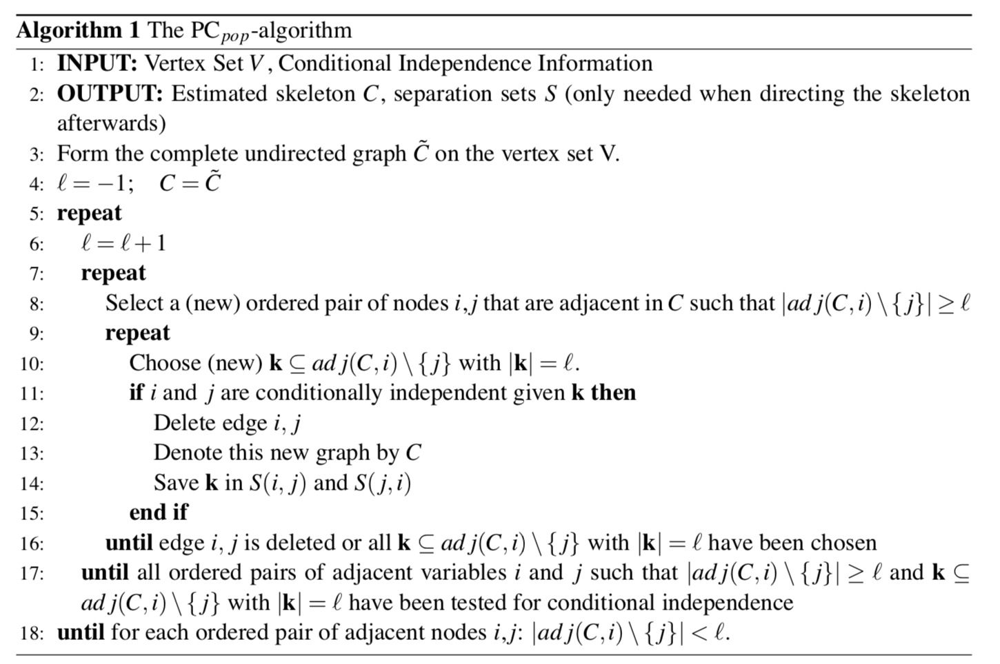
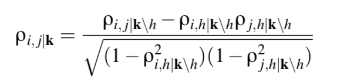
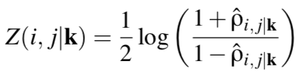
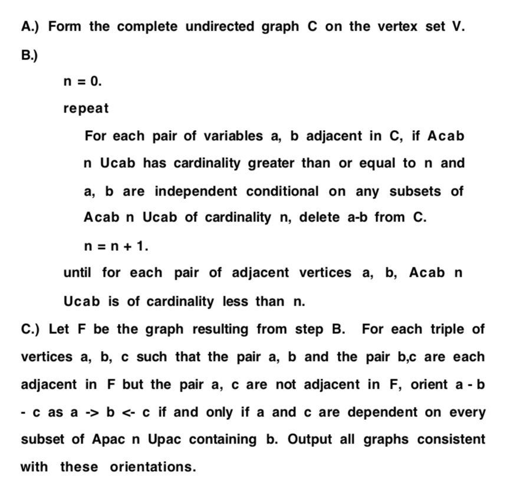

# PC Algorithm

### 理想情况（知道所有条件独立关系）

[Estimating High-Dimensional Directed Acyclic Graphs with the PC-Algorithm, Markus Kalisch, Peter Bu ̈hlmann. 2007](http://www.jmlr.org/papers/volume8/kalisch07a/kalisch07a.pdf)

line 11: 需要条件独立关系

### 偏相关系数

校正其它变量后某一变量与另一变量的相关关系，校正的意思可以理解为假定其它变量都取值为均数

服从高斯分布的随机变量，条件独立性与偏相关系数为0等价：

假设随机变量 $X$ 服从多元高斯分布，对于$i \not =j∈(1, ..., p)，k⊆(1, ..., p) /\ (i，j)$，用 $ρ_{i，j|k}$ 表示 $X(i)$ 和 $X(j)$ 与 $X^{(r)} (r∈k)$ 之间的偏相关系数 。 当且仅当 $X(i)$ 和 $X( j )$ 条件独立与 $X^{(r)} (r∈k)$ 时，$ρ_{i，j|k}=0$。

∴ 条件独立性可由偏相关估计出来，条件独立性检验转偏相关系数检验

任意两个变量$i, j$的$h$（排除其他$h$个变量的影响后，$h<=k-2$）阶样本偏相关系数：

### Fisher Z Test（$ρ\not=0$时的显著性检验）

$ρ\not=0$时不是正态分布，不能进行 $t$ 检验。将 $ρ$ 进行 Fisher Z 转换，转换后可以认为是正态分布。

Fisher’s z-transform:

零假设：$H_0(i,j|k):  ρ_{i，j|k} \not= 0$

对立假设：$H_1(i,j|k):  ρ_{i，j|k} = 0$

当$\sqrt{n-|k|-3}|Z(i,j|k)>Φ^{-1}(1-α/2)$，$H_0$成立

 

∴ 用$\sqrt{n-|k|-3}|Z(i,j|k)<=Φ^{-1}(1-α/2)$替换 PC-Algorithm 中的“如果 $i,j$ 被 $k$ $d-separation$”

[paper: Frequency Distribution of the Values of the Correlation Coefficient in Samples from an Indefinitely large population, Fisher, R.A., 1915](http://www.quantresearch.info/Fisher%20transform%20seminal%20paper.pdf)

### R语言实现

`zStat(x, y, S, C)`: 计算并返回$\sqrt{n-|k|-3}|Z(i,j|k)$的值

`pcorOrder(i, j, k, C)`: 计算并返回 $i$ 和 $j$ 与 $k$ 的偏相关系数

`condIndFisherZ(x, y, S, C)`: 计算$\sqrt{n-|k|-3}|Z(i,j|k)$，返回它是否<= cutoff

`gaussCItest(x, y, S, suffStat)`: 计算并返回$Φ^{-1}(1-α/2)$

### CPDAG

[An algorithm for fast recovery of sparse causal graphs, Peter Spirtes, Clark N. Glymour.,  1990](https://pdfs.semanticscholar.org/30d4/d4c7505008ea7362ec369311445f4bc8d27a.pdf)

得到骨架（无向图）。

任意 BN 的马尔科夫等价类都存在唯一的 CPDAG 与之等价，因此, CPDAG可作为贝叶斯网络等价类的图形化表示

将骨架扩展为等价类的CPDAG：

[Causal inference and causal explanation with background knowledge, Meek., 1995](http://101.96.10.63/delivery.acm.org/10.1145/2080000/2074204/p403-meek.pdf?ip=58.41.203.122&id=2074204&acc=ACTIVE%20SERVICE&key=BF85BBA5741FDC6E%2E1FD0E2C7647D7D03%2E4D4702B0C3E38B35%2E4D4702B0C3E38B35&__acm__=1543143342_db555b14bc922df517ed713f4bf3064e)

**一些定义：**

骨架：把有向图 $G$ 的有向边变成无向边。

PDAG：设 $G = (V, E)$ 是一个图，若边集 $E$ 中包含有向边和无向边，则称𝑃 是一个部分有向图。若部分有向图 𝑃 中不存在有向圈，则称 𝑃 是一个部分有向无环图(PDAG)

马尔科夫等价：贝叶斯网络 $<G_1, P_1>$ 和 $<G_2, P_2>$马尔科夫等价, 当且仅当 $G_1$ 和 $G_2$ 具有相同的框架和V结构

有向无环图 $G = (V, E)$ ，任意有向边 $V_i \rightarrow V_j ∈ E$，若存在图 $G' = (V, E')$ 与 $G$ 等价，且$V_j \rightarrow V_i ∈ E'$，则称有向边 $V_i \rightarrow V_j$ 在 $G$ 中是可逆的，否则是不可逆的.。

同理, 对任意无向边 $V_i \rightarrow V_j ∈ E​$，若存在  $G_1 = (V, E_1)​$、  $G_2 = (V, E_2)​$ 均与 $G​$ 等价，且$V_i \rightarrow V_j ∈ E_1​$、$V_j \rightarrow V_i ∈ E_2​$， 则 称 无 向边 $V_i \rightarrow V_j​$ 在 $G​$ 中是可逆的，否则是不可逆的

CPDAG：设 $G = (V, E)$ 是一个部分有向无环图，若 $E$ 中的有向边都是不可逆的，并且 $E$ 中的无向边都是可逆的，则称 $G$ 是一个完全部分有向无环图(CPDAG)
